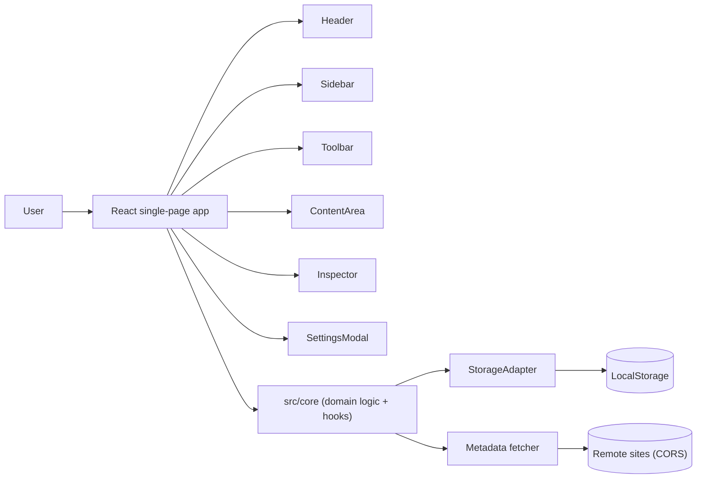

## Overview

BookmarkHarbor is a single-page React application that runs entirely in the browser. There is no backend, no account system, and no network API for the bookmark data. All state persists to `LocalStorage` through a small storage adapter, and the UI subscribes to that adapter for updates.

The code is split into two layers:

- `src/core/` holds framework-free domain logic: types, storage, selection, keyboard, history, import and export, metadata fetching, ordering, cycle detection, and validation.
- `src/components/` holds the React UI built with HeroUI, Tailwind CSS, and Iconify. Components receive callbacks and data from `App.tsx`, which owns the orchestration.

This document covers the component topology, the data model, persistence, the domain modules, key design decisions, theming, and internationalization. The source in `src/` remains the authoritative reference.

## Before you begin

- Working knowledge of React, TypeScript, and Vite.
- Familiarity with HeroUI (React Aria) compound components and Tailwind CSS.
- Basic understanding of the `@dnd-kit` drag-and-drop library.

## Architecture diagram



## Architecture components

| Component | Purpose |
| :--- | :--- |
| `App.tsx` | App shell. Owns global state, settings, selection, view routing, drag-and-drop context, and the modals. |
| `Header.tsx` | Top bar: search, theme and locale switches, sidebar and inspector toggles, and new-folder / new-bookmark actions. |
| `Sidebar.tsx` | Folder tree, filtered views (All, Favorites, Read Later, Trash), and a brand footer. |
| `Toolbar.tsx` | Breadcrumbs, selection actions, undo / redo, view mode, sorting. |
| `ContentArea.tsx` | Renders children in card, list, or tile view inside `@dnd-kit` sortable contexts. |
| `BookmarkItem.tsx` | A single bookmark or folder card / list row / tile, with cover, icon, color, and inline rename. |
| `SortableBookmarkItem.tsx` | `@dnd-kit` sortable wrapper around `BookmarkItem`, plus folder drop targets. |
| `Inspector.tsx` | Right panel to edit the selected item: title, URL, color, cover, icon, and metadata fetch. |
| `SelectionToolbar.tsx` | Floating multi-select action bar (favorite, read later, delete, restore). |
| `SettingsModal.tsx` | Application settings dialog. |
| `PanelResizer.tsx` | Pointer-capture handle that resizes the sidebar and inspector. |
| `ThemeSwitch.tsx` | HeroUI `Switch` used by settings. |
| `src/core/` | Framework-free domain logic and React hooks (see the domain modules section). |
| `src/i18n/` | i18next resources for `zh` and `en`. |

## Data model

The data model lives in `src/core/types.ts`. Two node types exist: `folder` and `bookmark`.

```ts
interface Node {
    id: string;
    type: 'folder' | 'bookmark';
    parentId: string | null;
    title: string;
    url?: string;          // bookmarks only
    orderKey: string;      // LexoRank-style sort key
    color?: string;        // hex color
    coverUrl?: string;
    coverType?: 'none' | 'uploaded' | 'remote' | 'generated';
    coverAssetId?: string;
    iconUrl?: string;
    iconAssetId?: string;
    iconSource?: 'favicon' | 'user' | 'apple-touch' | 'other';
    notes?: string;
    tags?: string[];
    isFavorite?: boolean;
    isReadLater?: boolean;
    createdAt: number;     // Unix timestamp, ms
    updatedAt: number;
    deletedAt?: number | null; // soft delete
}
```

Each node belongs to exactly one parent through `parentId`. The reserved folder `root` is the top of the tree; you cannot move or delete it.

### Persisted structure

`StorageData` is the shape persisted under the `aurabookmarks_data` key.

```ts
interface StorageData {
    version: number;
    nodes: Record<string, Node>;
    assets: Record<string, Asset>;
    metadataCache: Record<string, UrlMetadataCache>;
    settings: {
        theme: 'light' | 'dark' | 'system';
        locale: 'zh' | 'en';
        viewMode: 'list' | 'card' | 'tile';
        sidebarOpen: boolean;
        autoExpandTree: boolean;
        cardFolderPreviewSize: '2x2' | '3x3' | '4x3';
        customColors: string[];
        defaultViewMode: 'list' | 'card' | 'tile';
        rememberFolderView: boolean;
        folderViewModes: Record<string, string>;
        themeColor: string;
        singleClickAction: 'select' | 'open';
        cardColumnsDesktop: number;
        cardColumnsMobile: number;
        tileColumnsDesktop: number;
        tileColumnsMobile: number;
    };
}
```

| Setting | Default | Description |
| :--- | :--- | :--- |
| `theme` | `system` | Light, dark, or follow the system preference. |
| `locale` | `zh` | `zh` or `en`. |
| `viewMode` | `card` | Active view for the current folder. |
| `autoExpandTree` | `false` | Expand the sidebar tree to the current folder. |
| `cardFolderPreviewSize` | `2x2` | Folder cover preview grid in card and tile views. |
| `customColors` | `[]` | User-defined colors for the color picker. |
| `defaultViewMode` | `card` | View used when entering a folder without a remembered view. |
| `rememberFolderView` | `false` | Remember each folder's view separately. |
| `themeColor` | `#3B82F6` | Accent color; drives the whole palette. |
| `singleClickAction` | `select` | Whether a single click selects or opens. |
| `cardColumnsDesktop` | `4` | Card columns on desktop (2-9). |
| `cardColumnsMobile` | `2` | Card columns on mobile (1-4). |
| `tileColumnsDesktop` | `4` | Tile columns on desktop (1-7). |
| `tileColumnsMobile` | `2` | Tile columns on mobile (1-2). |

## Domain modules

`src/core/` organizes code by concern and re-exports the public surface from `src/core/index.ts`.

| Module | Responsibility |
| :--- | :--- |
| `types.ts` | Domain types and default storage data. |
| `storage/` | `StorageAdapter` and the `getStorage()` singleton. |
| `orderKey.ts` | LexoRank-style sort keys: `generateOrderKey`, `generateOrderKeys`, `rebalanceOrderKeys`. |
| `cycleDetection.ts` | `detectCycle`, `detectCycleForMultiple`, `getDescendantIds`, `getAncestorIds`, `buildBreadcrumbs`. |
| `utils.ts` | `generateId`, `debounce`, `throttle`, URL and HTML helpers, hashing, data URLs. |
| `validation.ts` | Zod schemas and limits for user-provided files and URLs. |
| `importExport/` | Netscape HTML bookmark parser and exporter. |
| `metadata/` | Remote metadata and favicon fetcher with SSRF checks and caching. |
| `hooks/` | React hooks: `useStorage`, `useNodes`, `useChildNodes`, `useNodeActions`, `useSettings`, `useTheme`, `useViewMode`, `useLocale`, `useSelection`, `useKeyboardShortcuts`, `useHistory`. |

### Storage adapter

`src/core/storage/localStorage.ts` implements `StorageAdapter`, a thin mutable layer over `LocalStorage`.

- `loadFromStorage()` parses and normalizes `aurabookmarks_data`, merging defaults, migrating legacy `grid` view to `card`, clamping column counts, and deleting the legacy `gridColumns` field.
- `save()` refreshes map and object references before writing and then notifies subscribers, so React state derived from the adapter updates reliably.
- Every mutation (create, update, move, delete, restore, settings) goes through `save()`.
- Deletion is soft by default: `deleteNodes` sets `deletedAt` unless `hard: true`. The `root` node is always excluded.

The adapter exposes a `subscribe(listener)` method. React hooks such as `useNodes` use it to re-render on change instead of managing a separate store.

### Ordering with LexoRank-style keys

`orderKey.ts` implements sort keys similar to LexoRank so that you can insert items between any two neighbors without renumbering. `moveNodes` computes a fresh key for the destination slot by generating the midpoint between the previous and next sibling keys. `generateOrderKeys` produces a contiguous run for bulk operations such as import.

### Cycle detection

Before a move, `detectCycleForMultiple` walks from the target parent up to the root and rejects the move if it would place a folder inside itself or one of its descendants. When `moveNodes` detects a cycle, it returns `false` and the UI keeps the item in place.

### Selection

`hooks/useSelection.ts` implements file-manager selection semantics with a single anchor for Shift range selection. `handleItemClick` maps a click event to `selectOne`, `toggleSelect` (Ctrl/Cmd), or `selectRange` (Shift). `getSelectionInfo` summarizes the current selection (count, whether it contains folders or bookmarks).

### Keyboard shortcuts

`hooks/useKeyboard.ts` binds `useKeyboardShortcuts`, which dispatches to callbacks provided by `App.tsx`. The handler suppresses shortcuts while you type in an input or rename an item. See the [frontend guide](/bookmark-harbor/ui/ui/) for the full list.

### History (undo / redo)

`hooks/useHistory.ts` implements a bounded undo / redo stack. Each entry carries `undo` and `redo` closures. Entries with the same `mergeKey` coalesce, so a repeated edit keeps one undo step. The default limit is 100 steps.

### Import and export

- `importExport/htmlParser.ts` parses Netscape bookmark HTML (`DL` / `DT` / `<H3>` / `<A>`), extracts titles, URLs, tags, icons, and notes, and converts the result into nodes.
- `importExport/htmlExporter.ts` generates the same format in the three export scopes (`all`, `folder`, `selection`) and triggers a download.

### Metadata fetching

`metadata/fetcher.ts` fetches a bookmark URL's title, description, Open Graph and Twitter image, and favicon. It enforces several guardrails:

- Only `http` / `https` URLs pass.
- The fetcher rejects private and loopback network addresses (SSRF guard).
- The fetcher bounds the response (5-second timeout, 2 MB cap, stops at `</head>`).
- A `createMetadataFetcher` wrapper caches results in `metadataCache` for 24 hours.

Because fetching runs from the browser, some sites that do not send CORS headers fail. In that case the UI falls back to favicon heuristics (`getFaviconUrl` or Google's favicon service).

### Validation

`validation.ts` defines Zod schemas for user-provided input:

- `htmlFileSchema`: `.html` / `.htm`, at most 5 MB.
- `imageFileSchema`: at most 200 KB, `png` / `jpeg` / `webp` / `svg`.
- `httpUrlSchema`: a valid `http` / `https` URL.

## State and data flow

`App.tsx` is the single owner of orchestration. It holds navigation state, selection, settings, view routing, the drag-and-drop context, and the modals, and passes data and callbacks down to components.

The view router supports four views:

- `bookmarks` — the current folder's contents.
- `favorites` — nodes with `isFavorite`.
- `readLater` — nodes with `isReadLater`.
- `trash` — nodes with `deletedAt`.

The active view and sort order filter and sort `currentChildren` before rendering. Search filters across all bookmarks or the current folder depending on `searchScope`.

## Design decisions

| Decision | Chosen | Alternative | Reason |
| :--- | :--- | :--- | :--- |
| Runtime | Single-page React app, no backend | Client-server app | Keeps data private, works offline, and requires no deployment infrastructure for the data layer. |
| Persistence | LocalStorage + in-memory adapter | SQLite / IndexedDB / D1 | Zero-config and sufficient for a personal bookmark library; the adapter boundary leaves room to swap storage later. |
| Core / UI split | Framework-free `src/core` | Domain logic inside React components | Pure modules are unit-testable without a DOM and reusable across UI changes. |
| Ordering | LexoRank-style order keys | Reindexing on every insert | Inserting between neighbors never rewrites sibling keys, so reordering stays cheap and deterministic. |
| Deletion | Soft delete to Trash | Hard delete | Lets users recover mistakes; `hard: true` exists for permanent removal. |
| Selection | Single anchor + Shift range | Redux-style selection store | Matches file-manager behavior and keeps the logic in a focused hook. |
| Import format | Netscape HTML | JSON / CSV | Native browser export format, so users can import from any modern browser. |
| Metadata fetch | Client-side with SSRF and size guards | Server-side proxy | No server to maintain; guards limit abuse risk of a client-side fetcher. |

## Theming

Themes use Tailwind 4's `@theme inline` mapping plus runtime CSS variables set by `App.tsx`.

- `src/styles/index.css` maps `--color-primary-*` Tailwind colors to runtime RGB variables through `@theme inline`.
- `App.tsx` derives a full palette (shades 50-950, accent, focus, foreground) from the user's `themeColor` whenever that setting changes.
- Dark mode toggles a `.dark` class on the document root; a `@custom-variant dark` declaration makes Tailwind's `dark:` variant match it.
- Panel widths are driven by `--sidebar-width` and `--inspector-width` CSS variables set from `App.tsx` state.

## Internationalization

`src/i18n/index.ts` initializes i18next with `zh` and `en` resources from `src/i18n/translations/`. The resources are type-safe TypeScript modules: `en.ts` uses the `Translation` type derived from `zh.ts`, so missing or extra keys fail at compile time. The active locale comes from settings, falling back to the browser language.

## What's next

- [Frontend design guide](/bookmark-harbor/ui/ui/) for views, interactions, and settings.
- [Development guide](/bookmark-harbor/dev/development/) for local setup, conventions, and testing.
- [Deployment guide](/bookmark-harbor/dev/deployment/) for building and hosting.
