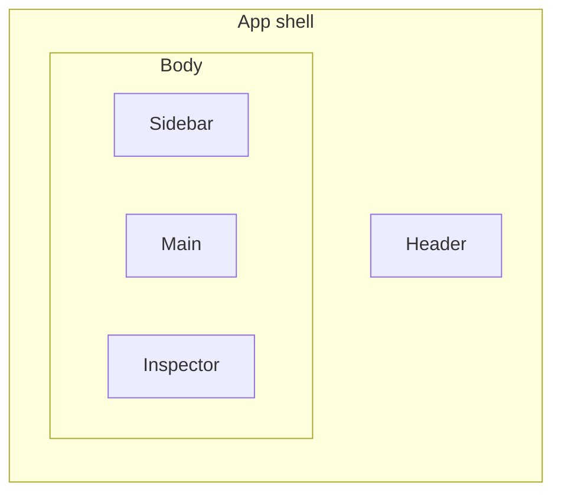

This guide describes the BookmarkHarbor user interface: the layout, the three views, the interaction rules, the settings, and the accessibility behavior. It is written for contributors who work on the UI and for users who want to understand how the app behaves.

## Overview

BookmarkHarbor presents your bookmark collection as a file-manager-style workspace. A sidebar shows the folder tree and filtered views, a toolbar shows breadcrumbs and actions, and the main content area renders the current folder's items in one of three views. An inspector panel on the right edits the selected item.

## Layout

| Region | Contents |
| :--- | :--- |
| Header (top) | Search box, theme and language switches, sidebar and inspector toggles, new-folder and new-bookmark actions. |
| Sidebar (left) | App title, filtered views (All Bookmarks, Favorites, Read Later, Trash), the folder tree, and a brand footer. The width is draggable. |
| Toolbar (above content) | Breadcrumbs, selection actions, undo / redo, view mode switch, and sorting. |
| Content (center) | The current folder's items in the active view. |
| Inspector (right) | Property editor for the selection. The width is draggable. |
| Selection toolbar (floating) | Appears at the bottom after you select items: favorite, read later, delete, restore, clear. |

On small screens the sidebar and inspector become fixed overlay panels with a backdrop; toggling them from the header opens and closes them.

## Views

The active view determines how items render. Switch views from the toolbar.

| View | Behavior |
| :--- | :--- |
| Card | A responsive grid of cover-forward cards. Column counts are configurable for desktop and mobile. |
| List | A compact single-column layout with inline details; supports Shift range selection. |
| Tile | A denser grid of tiles. Column counts are configurable for desktop and mobile. |

Folders render a color-coded icon and, in card and tile views, a preview grid of their immediate children. `cardFolderPreviewSize` controls the preview grid size (`2x2`, `3x3`, or `4x3`).

## Interactions

The app keeps the following rules consistent across all views.

### Selection

| Action | Result |
| :--- | :--- |
| Single click | Select the item (or open it when `singleClickAction` is `open`). |
| Ctrl / Cmd + click | Toggle the item in or out of the selection. |
| Shift + click | Select the contiguous range from the anchor to the clicked item (list view). |
| Double click | Open a folder, or open a bookmark in a new tab. |
| Selection mode | Enable from the toolbar; checkboxes show on hover or always in selection mode. |
| Select all / clear / invert | Available from the toolbar. |

### Drag and drop

`@dnd-kit` powers drag and drop.

- Drag an item to reorder it within a folder.
- Drag an item onto a sidebar folder or a folder card to move it there.
- Dropping a folder into itself or a descendant fails cycle detection, so the item stays in place.

### Inline rename

Press `F2` (or start a rename) to edit a title inline. Press `Enter` to submit and `Escape` to cancel.

## Keyboard shortcuts

The app ignores shortcuts while you type in an input or rename an item.

| Key | Action |
| :--- | :--- |
| `Escape` | Clear the selection, or cancel an inline rename. |
| `Delete` / `Backspace` | Delete the selected items. |
| `F2` | Rename the single selected item. |
| `Ctrl` / `Cmd` + `A` | Select all visible items. |
| `Ctrl` / `Cmd` + `F` | Focus the search box. |
| `Ctrl` / `Cmd` + `Shift` + `N` | Create a new folder. |
| `Ctrl` / `Cmd` + `N` | Create a new bookmark. |
| `Ctrl` / `Cmd` + `C` | Copy the selection. |
| `Ctrl` / `Cmd` + `V` | Paste. |
| `Ctrl` / `Cmd` + `X` | Cut. |
| `Ctrl` / `Cmd` + `Z` | Undo. |
| `Ctrl` / `Cmd` + `Shift` + `Z` | Redo. |
| `Alt` + `Left`, or `Ctrl` / `Cmd` + `Backspace` | Go up one folder. |

## Settings

Open settings from the sidebar. The following table lists every option with its default.

| Setting | Default | Description |
| :--- | :--- | :--- |
| Theme | System | Light, dark, or follow the operating system. |
| Language | Chinese | `zh` or `en`. |
| Theme color | `#3B82F6` | Accent color; derives the full palette. |
| Custom colors | (empty) | Add your own colors to the color picker. |
| Auto expand folder tree | Off | Expand the sidebar tree to the current folder. |
| Default view mode | Card | View shown when entering a folder without a remembered view. |
| Remember view per folder | Off | Keep a separate view mode per folder. |
| Card folder preview size | `2x2` | Folder preview grid in card and tile views. |
| Single click action | Select | Whether a single click selects or opens. |
| Card columns (desktop / mobile) | 4 / 2 | Columns of the card grid. |
| Tile columns (desktop / mobile) | 4 / 2 | Columns of the tile grid. |
| Clear data | — | Deletes all bookmarks, folders, favorites, and settings from browser storage. |

Changing the default view mode also switches the current view so the browser sees the same mode it set as default.

**Clear data**: The **Clear data** button sits at the end of Settings. Pressing it opens a confirmation dialog that warns you to export your bookmarks first. Confirming clears every key in `localStorage` (including the panel-widths key) and resets the app to a fresh library with default settings; it also closes Settings and navigates to the root folder.

## Search

Use the search box in the header. Search filters the visible content by the query; scope is `all` or `current` depending on the search setting. `Ctrl` / `Cmd` + `F` focuses the search box.

## Import and export

- Import: from the header, select one or more `.html` / `.htm` Netscape bookmark files (up to 5 MB each). Each file becomes a folder named after the file.
- Export: from the header, choose the scope — the whole library, the current folder, or the current selection. The app downloads a Netscape HTML file.

## Accessibility

The app follows these accessibility practices.

- A skip-to-content link is present for keyboard and screen-reader users.
- Modals support focus management and keyboard dismissal (`Escape`).
- Icon buttons expose an accessible name via `aria-label`.
- Panel resizers expose `role="separator"`, `aria-orientation="vertical"`, and a localized `aria-label`.
- Selection controls are keyboard-operable and never rely on hover alone (selection mode shows checkboxes persistently).
- Color is not the only indicator of state; selection also changes background and foreground.
- i18next localizes all user-facing text so both languages render correctly.

## Responsive behavior

- The sidebar and inspector are resizable on desktop with a drag handle; widths persist to LocalStorage.
- Below the `sm` breakpoint, the sidebar and inspector collapse to overlay panels with a semi-transparent backdrop that you open from the header.
- Card and tile grids adapt their column count to the configured desktop and mobile values.

## What's next

- [Architecture guide](/bookmark-harbor/dev/architecture/) for the data model and domain modules.
- [Development guide](/bookmark-harbor/dev/development/) for conventions and testing.
- [Deployment guide](/bookmark-harbor/dev/deployment/) for building and hosting.
