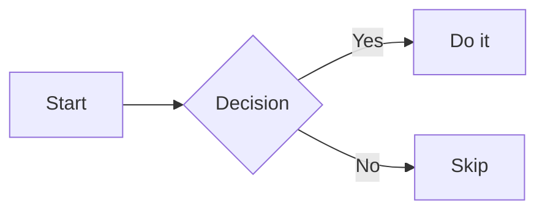

`mermaid` code fences in the docs render as **interactive vector diagrams**: wheel to zoom,
drag to pan, and a toolbar (dropdown menu) with zoom in / zoom out / fit / reset / fullscreen / copy code.

## Live demo

The diagram below is rendered in place from a `mermaid` fence in this very page:

````md

````


Any Mermaid syntax works — flowchart, sequence, class, state, ER, Gantt, pie, etc.

## Interactions

| Input | Effect |
| :--- | :--- |
| Mouse wheel | Zoom in / out around the cursor |
| Mouse drag (hold left button) | Pan the diagram |
| Toolbar → **Zoom in / Zoom out** | Step zoom around the viewport center |
| Toolbar → **Fit to width** | Return to the initial fit-to-width view |
| Toolbar → **Reset** | Reset to `scale = 1`, aligned top-left |
| Toolbar → **Fullscreen** | Open the diagram in a fullscreen overlay (Escape / backdrop click / close button exits) |
| Toolbar → **Copy code** | Copy the raw mermaid source to the clipboard |

The diagram is **pure SVG** — zoom stays crisp at any magnification because the transform
is applied through the SVG's own `<g>` element, never by rasterizing the image.

## Height

The diagram height adapts to its **aspect ratio**: the container is as tall as the diagram
needs to be, so a wide flowchart stays short and a tall sequence diagram grows with the page.
There is no fixed-height crop.

## Theme

Diagrams follow the site theme: rendering re-runs automatically when you switch
light / dark, so node text and edge colors stay readable.

## Failure handling

If a diagram fails to render (unsupported syntax, renderer error), the container shows the
error message followed by the **raw source**, so the content is never lost and can still be
copied.

## How it works

- **Server (build time)**: the remark plugin `src/lib/markdown/remark-mermaid.ts` turns a
  `mermaid` code fence into a `.cpd-mermaid` container with the source embedded as JSON
  (registered via `markdown.remarkPlugins` in `astro.config.mjs`).
- **Client**: `src/lib/ui/mermaid.ts` lazily loads `mermaid` only when a diagram is present,
  renders the SVG, wires the toolbar and the fullscreen overlay; `src/lib/ui/mermaid-pan-zoom.ts`
  is a dependency-free pan/zoom controller modeled on
  [`panzoom`](https://github.com/anvaka/panzoom) and
  [`svg-pan-zoom`](https://github.com/bumbu/svg-pan-zoom), applying transforms through the
  SVG's native `<g>` element so zooming stays vector-crisp.
- Styles live in `src/styles/celestial-docs.css` (`.cpd-mermaid*`).

Keep this page in sync when the rendering or toolbar behavior changes.
