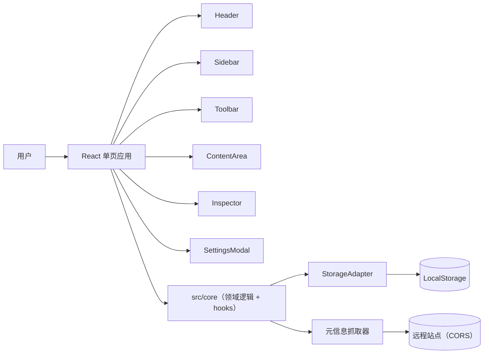

## 概述

书签浏览器是一个完全在浏览器内运行的单页 React 应用。它没有后端、没有账号体系、也没有用于书签数据的网络 API。所有状态都通过一个小型存储适配器持久化到 `LocalStorage`，UI 通过订阅该适配器来实现更新。

代码分为两层：

- `src/core/` 存放无框架领域逻辑：类型、存储、选择、键盘、历史、导入导出、元信息抓取、排序、循环检测与校验。
- `src/components/` 存放基于 HeroUI、Tailwind CSS 与 Iconify 构建的 React UI。组件从 `App.tsx` 接收数据与回调，`App.tsx` 负责整体编排。

本文档介绍组件拓扑、数据模型、持久化、领域模块、关键设计决策、主题与国际化。源码 `src/` 仍是权威参考。

## 开始之前

- 熟悉 React、TypeScript 与 Vite。
- 熟悉 HeroUI（React Aria）组合式组件与 Tailwind CSS。
- 了解 `@dnd-kit` 拖拽库的基本用法。

## 架构图



## 架构组件

| 组件 | 用途 |
| :--- | :--- |
| `App.tsx` | 应用外壳。管理全局状态、设置、选择、视图路由、拖拽上下文与弹窗。 |
| `Header.tsx` | 顶栏：搜索、主题与语言切换、侧边栏与属性面板开关、新建文件夹 / 新建书签。 |
| `Sidebar.tsx` | 文件夹树、过滤视图（全部 / 收藏夹 / 稍后阅读 / 回收站）以及品牌页脚。 |
| `Toolbar.tsx` | 面包屑、选择操作、撤销 / 重做、视图模式、排序。 |
| `ContentArea.tsx` | 在 `@dnd-kit` 可排序上下文中以卡片 / 列表 / 平铺视图渲染子项。 |
| `BookmarkItem.tsx` | 单个书签或文件夹卡片 / 列表行 / 平铺块，含封面、图标、颜色与内联重命名。 |
| `SortableBookmarkItem.tsx` | `BookmarkItem` 的 `@dnd-kit` 可排序包装，含文件夹放置目标。 |
| `Inspector.tsx` | 右侧面板，编辑选中项：标题、URL、颜色、封面、图标与元信息抓取。 |
| `SelectionToolbar.tsx` | 浮动的多选操作条（收藏、稍后阅读、删除、恢复）。 |
| `SettingsModal.tsx` | 应用设置对话框。 |
| `PanelResizer.tsx` | 基于指针捕获的手柄，用于调整侧边栏与属性面板宽度。 |
| `ThemeSwitch.tsx` | 供设置使用的 HeroUI `Switch`。 |
| `src/core/` | 无框架领域逻辑与 React hooks（见领域模块一节）。 |
| `src/i18n/` | `zh` 与 `en` 的 i18next 资源。 |

## 数据模型

数据模型位于 `src/core/types.ts`。节点有两种类型：`folder`（文件夹）与 `bookmark`（书签）。

```ts
interface Node {
    id: string;
    type: 'folder' | 'bookmark';
    parentId: string | null;
    title: string;
    url?: string;          // 仅书签
    orderKey: string;      // LexoRank 风格排序键
    color?: string;        // hex 颜色
    coverUrl?: string;
    coverType?: 'none' | 'uploaded' | 'remote' | 'generated';
    coverAssetId?: string;
    iconUrl?: string;
    iconAssetId?: string;
    iconSource?: 'favicon' | 'user' | 'apple-touch' | 'other';
    notes?: string;
    tags?: string[];
    isFavorite?: boolean;
    isReadLater?: boolean;
    createdAt: number;     // Unix 时间戳，毫秒
    updatedAt: number;
    deletedAt?: number | null; // 软删除
}
```

每个节点通过 `parentId` 属于且仅属于一个父节点。保留文件夹 `root` 是树的顶层，不能被移动或删除。

### 持久化结构

`StorageData` 是以 `aurabookmarks_data` 键持久化的结构。

```ts
interface StorageData {
    version: number;
    nodes: Record<string, Node>;
    assets: Record<string, Asset>;
    metadataCache: Record<string, UrlMetadataCache>;
    settings: {
        theme: 'light' | 'dark' | 'system';
        locale: 'zh' | 'en';
        viewMode: 'list' | 'card' | 'tile';
        sidebarOpen: boolean;
        autoExpandTree: boolean;
        cardFolderPreviewSize: '2x2' | '3x3' | '4x3';
        customColors: string[];
        defaultViewMode: 'list' | 'card' | 'tile';
        rememberFolderView: boolean;
        folderViewModes: Record<string, string>;
        themeColor: string;
        singleClickAction: 'select' | 'open';
        cardColumnsDesktop: number;
        cardColumnsMobile: number;
        tileColumnsDesktop: number;
        tileColumnsMobile: number;
    };
}
```

| 设置项 | 默认值 | 说明 |
| :--- | :--- | :--- |
| `theme` | `system` | 浅色、深色或跟随系统。 |
| `locale` | `zh` | `zh` 或 `en`。 |
| `viewMode` | `card` | 当前文件夹的活动视图。 |
| `autoExpandTree` | `false` | 侧边栏展开到当前文件夹。 |
| `cardFolderPreviewSize` | `2x2` | 卡片 / 平铺视图中文件夹的封面预览网格。 |
| `customColors` | `[]` | 用户自定义的颜色。 |
| `defaultViewMode` | `card` | 进入无记忆视图的文件夹时使用的视图。 |
| `rememberFolderView` | `false` | 是否按文件夹分别记忆视图。 |
| `themeColor` | `#3B82F6` | 强调色，驱动整套配色。 |
| `singleClickAction` | `select` | 单击是选中还是打开。 |
| `cardColumnsDesktop` | `4` | 桌面端卡片列数（2-9）。 |
| `cardColumnsMobile` | `2` | 移动端卡片列数（1-4）。 |
| `tileColumnsDesktop` | `4` | 桌面端平铺列数（1-7）。 |
| `tileColumnsMobile` | `2` | 移动端平铺列数（1-2）。 |

## 领域模块

`src/core/` 按关注点组织，公开接口由 `src/core/index.ts` 统一导出。

| 模块 | 职责 |
| :--- | :--- |
| `types.ts` | 领域类型与默认存储数据。 |
| `storage/` | `StorageAdapter` 与 `getStorage()` 单例。 |
| `orderKey.ts` | LexoRank 风格排序键：`generateOrderKey`、`generateOrderKeys`、`rebalanceOrderKeys`。 |
| `cycleDetection.ts` | `detectCycle`、`detectCycleForMultiple`、`getDescendantIds`、`getAncestorIds`、`buildBreadcrumbs`。 |
| `utils.ts` | `generateId`、`debounce`、`throttle`、URL 与 HTML 工具、哈希、Data URL。 |
| `validation.ts` | 针对用户提供的文件与 URL 的 Zod 校验与限制。 |
| `importExport/` | Netscape HTML 书签解析器与导出器。 |
| `metadata/` | 带 SSRF 校验与缓存的远程元信息与图标抓取器。 |
| `hooks/` | React hooks：`useStorage`、`useNodes`、`useChildNodes`、`useNodeActions`、`useSettings`、`useTheme`、`useViewMode`、`useLocale`、`useSelection`、`useKeyboardShortcuts`、`useHistory`。 |

### 存储适配器

`src/core/storage/localStorage.ts` 实现 `StorageAdapter`，这是基于 `LocalStorage` 的轻量可变层。

- `loadFromStorage()` 解析并规范化 `aurabookmarks_data`：合并默认值、将旧版 `grid` 视图迁移为 `card`、裁剪列数、删除旧版 `gridColumns` 字段。
- `save()` 在写入前刷新 map 与对象引用，然后通知订阅者，确保从适配器派生出的 React 状态可靠更新。
- 每次变更（创建、更新、移动、删除、恢复、设置）都经过 `save()`。
- 删除默认是软删除：`deleteNodes` 会设置 `deletedAt`，除非传入 `hard: true`。`root` 节点始终被排除在外。

适配器暴露 `subscribe(listener)` 方法。`useNodes` 等 React hooks 通过它来在变化时重渲染，而不需要额外的状态库。

### 基于 LexoRank 风格的排序

`orderKey.ts` 实现类似 LexoRank 的排序键，使项目可以插入到任意相邻项之间而无需重排。`moveNodes` 通过计算前后兄弟键的中点，为目标插入位置生成新键。`generateOrderKeys` 为导入等批量操作生成连续的一段键。

### 循环检测

移动之前，`detectCycleForMultiple` 会从目标父节点向上回溯到根目录，如果该移动会把文件夹放到自身或其子孙内部，则拒绝该移动。检测到循环时 `moveNodes` 返回 `false`，UI 会让项目保持原位。

### 选择

`hooks/useSelection.ts` 以单个锚点实现文件管理器风格的选择语义，用于 Shift 范围选择。`handleItemClick` 将点击事件映射为 `selectOne`、`toggleSelect`（Ctrl / Cmd）或 `selectRange`（Shift）。`getSelectionInfo` 汇总当前选择（数量、是否包含文件夹或书签）。

### 键盘快捷键

`hooks/useKeyboard.ts` 绑定 `useKeyboardShortcuts`，将事件派发到 `App.tsx` 提供的回调。当用户在输入框内输入或正在重命名时，快捷键会被抑制。完整列表见[前端指南](/zh/bookmark-harbor/ui/ui/)。

### 历史（撤销 / 重做）

`hooks/useHistory.ts` 实现有界的撤销 / 重做栈。每个条目携带 `undo` 与 `redo` 闭包。具有相同 `mergeKey` 的条目会合并，因此连续的同类型编辑只占用一步撤销。默认上限为 100 步。

### 导入与导出

- `importExport/htmlParser.ts` 解析 Netscape 书签 HTML（`DL` / `DT` / `<H3>` / `<A>`），提取标题、URL、标签、图标与备注，并转换为节点。
- `importExport/htmlExporter.ts` 在三种导出范围（`all`、`folder`、`selection`）下生成相同格式并触发下载。

### 元信息抓取

`metadata/fetcher.ts` 抓取书签 URL 的标题、描述、Open Graph 与 Twitter 图片以及 favicon。它实施了几项防护：

- 只允许 `http` / `https` URL。
- 拒绝私有与回环网络地址（SSRF 防护）。
- 限制响应规模（5 秒超时、2 MB 上限、读到 `</head>` 即停止）。
- `createMetadataFetcher` 包装器将结果缓存到 `metadataCache`，缓存 24 小时。

由于抓取在浏览器内执行，部分未发送 CORS 头的网站会失败。此时 UI 会回退到 favicon 试探（`getFaviconUrl` 或 Google 的 favicon 服务）。

### 校验

`validation.ts` 为用户输入定义 Zod 校验：

- `htmlFileSchema`：`.html` / `.htm`，最大 5 MB。
- `imageFileSchema`：最大 200 KB，类型为 `png` / `jpeg` / `webp` / `svg`。
- `httpUrlSchema`：合法的 `http` / `https` URL。

## 状态与数据流

`App.tsx` 是编排的唯一所有者。它持有导航状态、选择、设置、视图路由、拖拽上下文与弹窗，并将数据与回调传递给组件。

视图路由支持四种视图：

- `bookmarks` — 当前文件夹的内容。
- `favorites` — `isFavorite` 为真的节点。
- `readLater` — `isReadLater` 为真的节点。
- `trash` — 软删除（`deletedAt`）的节点。

活动视图与排序方式会先过滤、排序 `currentChildren` 再渲染。搜索根据 `searchScope` 作用于全部书签或当前文件夹。

## 设计决策

| 决策 | 选择 | 备选 | 理由 |
| :--- | :--- | :--- | :--- |
| 运行形态 | 单页 React 应用、无后端 | 客户端-服务端应用 | 数据私密、可离线、无需为数据层建设部署基础设施。 |
| 持久化 | LocalStorage + 内存适配器 | SQLite / IndexedDB / D1 | 零配置且足以支撑个人书签库；适配器边界为日后更换存储保留空间。 |
| 核心 / UI 拆分 | 无框架的 `src/core` | 领域逻辑放在 React 组件内 | 纯模块无需 DOM 即可单测，且便于 UI 复用。 |
| 排序 | LexoRank 风格排序键 | 每次插入重新编号 | 相邻插入永不重写兄弟键，重排保持廉价且确定。 |
| 删除 | 软删除进入回收站 | 硬删除 | 允许用户恢复误删；`hard: true` 用于永久删除。 |
| 选择 | 单一锚点 + Shift 范围 | Redux 风格选择 store | 符合文件管理器行为，逻辑集中在独立 hook 中。 |
| 导入格式 | Netscape HTML | JSON / CSV | 浏览器原生导出格式，可导入任意现代浏览器。 |
| 元信息抓取 | 客户端 + SSRF 与大小防护 | 服务端代理 | 无需维护服务端；防护限制客户端抓取器的滥用风险。 |

## 主题

主题使用 Tailwind 4 的 `@theme inline` 映射，加上 `App.tsx` 设置的运行时 CSS 变量。

- `src/styles/index.css` 通过 `@theme inline` 将 `--color-primary-*` Tailwind 颜色映射到运行时 RGB 变量。
- `App.tsx` 在 `themeColor` 变化时，从用户的主题色推导整套配色（50-950 色阶、强调色、焦点色、前景色）。
- 暗色模式通过在文档根元素上切换 `.dark` 类实现；`@custom-variant dark` 声明让 Tailwind 的 `dark:` 变体与之匹配。
- 面板宽度由 `App.tsx` 状态设置的 `--sidebar-width` 与 `--inspector-width` CSS 变量驱动。

## 国际化

`src/i18n/index.ts` 以 `zh` 与 `en` 资源初始化 i18next，资源来自 `src/i18n/translations/`。资源是带类型的 TypeScript 模块：`en.ts` 以从 `zh.ts` 派生的 `Translation` 类型作为类型依据，因此缺失或多余的键会在编译期报错。当前语言从设置读取，并以浏览器语言作为回退。

## 下一步

- [前端设计指南](/zh/bookmark-harbor/ui/ui/)了解视图、交互与设置。
- [开发指南](/zh/bookmark-harbor/dev/development/)了解本地搭建、规范与测试。
- [部署指南](/zh/bookmark-harbor/dev/deployment/)了解构建与托管。
