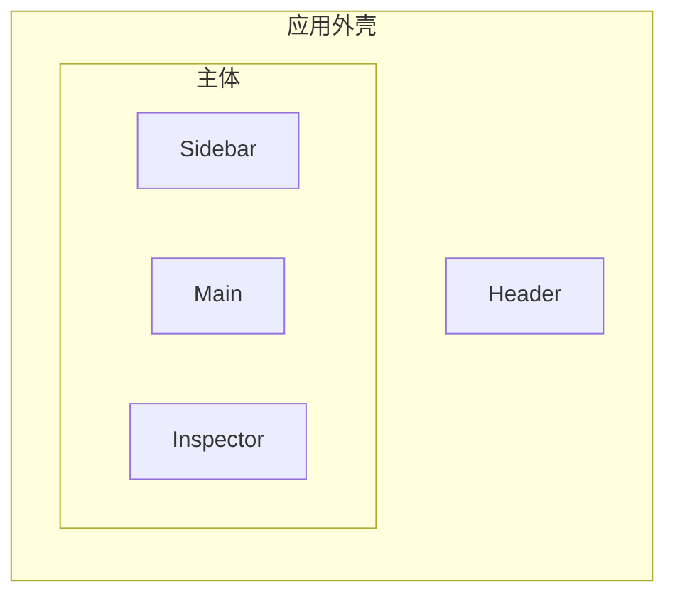

本指南介绍书签浏览器的用户界面：布局、三种视图、交互规则、设置与无障碍行为。它是为从事 UI 工作的贡献者以及希望了解应用行为的用户编写的。

## 概述

书签浏览器将你的书签集合呈现为一个文件管理器风格的工作区。侧边栏显示文件夹树与过滤视图，工具栏显示面包屑与操作，主内容区以三种视图之一渲染当前文件夹的项目。右侧属性面板用于编辑选中项。

## 布局

| 区域 | 内容 |
| :--- | :--- |
| 顶栏 Header | 搜索框、主题与语言切换、侧边栏与属性面板开关、新建文件夹与新建书签。 |
| 侧边栏 Sidebar | 应用标题、过滤视图（全部书签 / 收藏夹 / 稍后阅读 / 回收站）、文件夹树与品牌页脚。宽度可拖拽。 |
| 工具栏 Toolbar | 面包屑、选择操作、撤销 / 重做、视图切换与排序。 |
| 内容区 Content | 以活动视图渲染当前文件夹的项目。 |
| 属性面板 Inspector | 选中项的属性编辑器。宽度可拖拽。 |
| 选择工具栏（浮动）| 有选中项时出现在底部：收藏、稍后阅读、删除、恢复、清空。 |

在小屏幕上，侧边栏与属性面板会变成带背景遮罩的固定覆盖面板，通过顶栏的开关来开合。

## 视图

活动视图决定项目的渲染方式。可在工具栏切换视图。

| 视图 | 行为 |
| :--- | :--- |
| 卡片 Card | 封面优先的响应式网格。桌面端与移动端列数可配置。 |
| 列表 List | 紧凑的单列布局，带行内详情；支持 Shift 范围选择。 |
| 平铺 Tile | 更紧凑的网格。桌面端与移动端列数可配置。 |

文件夹渲染为配色图标，并在卡片与平铺视图中渲染其直接子项的预览网格。`cardFolderPreviewSize` 控制预览网格大小（`2x2`、`3x3` 或 `4x3`）。

## 交互

应用在所有视图中保持以下规则一致。

### 选择

| 操作 | 结果 |
| :--- | :--- |
| 单击 | 选中该项目（当 `singleClickAction` 为 `open` 时打开）。 |
| Ctrl / Cmd + 单击 | 切换该项目是否入选。 |
| Shift + 单击 | 从锚点选中到被点击项目的连续范围（列表视图）。 |
| 双击 | 打开文件夹，或在新的标签页打开书签。 |
| 选择模式 | 从工具栏开启；在悬停或选择模式下显示勾选框。 |
| 全选 / 清空 / 反选 | 可从工具栏使用。 |

### 拖拽

拖拽由 `@dnd-kit` 驱动。

- 拖拽项目以在同一文件夹内重新排序。
- 拖到侧边栏文件夹或文件夹卡片上以移动过去。
- 将文件夹拖入自身或子孙会被拒绝（循环检测），项目保持原位。

### 内联重命名

按 `F2`（或发起重命名）可内联编辑标题。按 `Enter` 提交，按 `Escape` 取消。

## 键盘快捷键

在输入框内输入或重命名项目时，快捷键会被忽略。

| 按键 | 操作 |
| :--- | :--- |
| `Escape` | 清空选择，或取消内联重命名。 |
| `Delete` / `Backspace` | 删除选中的项目。 |
| `F2` | 重命名单个选中项。 |
| `Ctrl` / `Cmd` + `A` | 全选可见项目。 |
| `Ctrl` / `Cmd` + `F` | 聚焦搜索框。 |
| `Ctrl` / `Cmd` + `Shift` + `N` | 新建文件夹。 |
| `Ctrl` / `Cmd` + `N` | 新建书签。 |
| `Ctrl` / `Cmd` + `C` | 复制选择。 |
| `Ctrl` / `Cmd` + `V` | 粘贴。 |
| `Ctrl` / `Cmd` + `X` | 剪切。 |
| `Ctrl` / `Cmd` + `Z` | 撤销。 |
| `Ctrl` / `Cmd` + `Shift` + `Z` | 重做。 |
| `Alt` + `Left`，或 `Ctrl` / `Cmd` + `Backspace` | 返回上级文件夹。 |

## 设置

从侧边栏打开设置。下表列出每个选项及其默认值。

| 设置项 | 默认值 | 说明 |
| :--- | :--- | :--- |
| 主题 | 跟随系统 | 浅色、深色或跟随操作系统。 |
| 语言 | 简体中文 | `zh` 或 `en`。 |
| 主题颜色 | `#3B82F6` | 强调色，推导整套配色。 |
| 自定义颜色 | （空） | 向颜色选择器添加你自己的颜色。 |
| 自动展开文件夹树 | 关 | 侧边栏展开到当前文件夹。 |
| 默认视图模式 | 卡片 | 进入无记忆视图的文件夹时显示的视图。 |
| 记忆文件夹视图 | 关 | 为每个文件夹单独保留视图模式。 |
| 卡片文件夹预览尺寸 | `2x2` | 卡片与平铺视图中的文件夹预览网格。 |
| 单击行为 | 选中 | 单击是选中还是打开。 |
| 卡片列数（桌面 / 移动） | 4 / 2 | 卡片网格的列数。 |
| 平铺列数（桌面 / 移动） | 4 / 2 | 平铺网格的列数。 |
| 清除数据 | — | 删除浏览器存储中的全部书签、文件夹、收藏与设置。 |

更改默认视图模式也会切换当前视图，使浏览器看到的模式与其设置的默认值一致。

**清除数据**：设置末尾的**清除数据**按钮会弹出确认对话框，提醒你先导出书签。确认后它会清空 `localStorage` 中的全部键（包括面板宽度键），并把应用重置为默认设置的全新书签库；同时关闭设置并回到根文件夹。

## 搜索

使用顶栏的搜索框。搜索按查询过滤可见内容；范围依据搜索设置取 `all` 或 `current`。按 `Ctrl` / `Cmd` + `F` 聚焦搜索框。

## 导入与导出

- 导入：从顶栏选择一个或多个 `.html` / `.htm` Netscape 书签文件（每个不超过 5 MB）。每个文件会生成一个以文件名命名的文件夹。
- 导出：从顶栏选择范围——整个书签库、当前文件夹、或当前选择。应用会下载一个 Netscape HTML 文件。

## 无障碍

应用遵循以下无障碍实践。

- 提供跳转到正文的链接，方便键盘与屏幕阅读器用户。
- 弹窗支持焦点管理，并可通过 `Escape` 键关闭。
- 图标按钮通过 `aria-label` 暴露可访问名称。
- 面板调整手柄暴露 `role="separator"`、`aria-orientation="vertical"` 与本地化的 `aria-label`。
- 选择控件可由键盘操作，绝不只依赖悬停（选择模式会持续显示勾选框）。
- 颜色不是状态的唯一指示；选中同时会改变背景与前景。
- 所有面向用户的文本都通过 i18next 本地化，两种语言都能正确渲染。

## 响应式行为

- 桌面端可通过拖拽手柄调整侧边栏与属性面板宽度，宽度持久化到 LocalStorage。
- 在 `sm` 断点以下，侧边栏与属性面板折叠为带半透明背景的覆盖面板，从顶栏打开。
- 卡片与平铺网格根据配置的桌面端与移动端列数自适应。

## 下一步

- [架构指南](/zh/bookmark-harbor/dev/architecture/)了解数据模型与领域模块。
- [开发指南](/zh/bookmark-harbor/dev/development/)了解规范与测试。
- [部署指南](/zh/bookmark-harbor/dev/deployment/)了解构建与托管。
