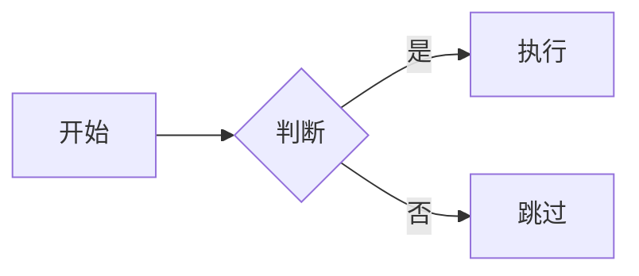

文档正文中的 `mermaid` 代码块会渲染为**可交互的矢量图表**：滚轮缩放、按住拖动平移，
右上角工具栏（一个下拉菜单）提供放大 / 缩小 / 适应宽度 / 复位 / 全屏 / 复制代码。

## 实时演示

下面的图表就是本页里的 `mermaid` 围栏代码块就地渲染的：

````md

````


任意 Mermaid 语法都可用 —— flowchart、sequence、class、state、ER、Gantt、pie 等。

## 交互

| 输入 | 效果 |
| :--- | :--- |
| 鼠标滚轮 | 围绕光标放大 / 缩小 |
| 按住左键拖动 | 平移图表 |
| 工具栏 → **放大 / 缩小** | 以视口中心为锚点步进缩放 |
| 工具栏 → **适应宽度** | 回到初始的按宽度适配视图 |
| 工具栏 → **复位** | 恢复 `scale = 1`，左上角对齐 |
| 工具栏 → **全屏** | 在全屏弹层中查看图表（Escape / 点遮罩 / 关闭按钮退出） |
| 工具栏 → **复制代码** | 把 mermaid 源码复制到剪贴板 |

图表是**纯 SVG**：变换通过 SVG 自身的 `<g>` 元素施加，绝不栅格化成位图，
因此任意放大倍数下都保持清晰。

## 高度

图表高度按**宽高比自适应**：容器高度等于图表需要的高度，
宽图保持矮扁、高的时序图随页面自然变高，不做固定高度裁切。

## 主题

图表跟随站点主题：切换浅色 / 深色时会自动重渲染，
节点文字与连线颜色始终保持可读。

## 失败兜底

如果图表渲染失败（语法不支持、渲染器报错），容器内会显示错误信息与**原始源码**，
内容不会丢失，仍可复制。

## 实现方式

- **服务端（构建期）**：remark 插件 `src/lib/markdown/remark-mermaid.ts` 把 `mermaid`
  围栏代码块替换为 `.cpd-mermaid` 容器，源码以 JSON 形式内嵌
  （经 `astro.config.mjs` 的 `markdown.remarkPlugins` 注册）。
- **客户端**：`src/lib/ui/mermaid.ts` 仅在存在图表时按需加载 `mermaid`、
  渲染 SVG、挂接工具栏与全屏弹层；`src/lib/ui/mermaid-pan-zoom.ts` 是零依赖的
  缩放/平移控制器，参考 [`panzoom`](https://github.com/anvaka/panzoom) 与
  [`svg-pan-zoom`](https://github.com/bumbu/svg-pan-zoom)，变换作用在 SVG 原生 `<g>` 上，
  缩放始终矢量清晰。
- 样式位于 `src/styles/celestial-docs.css`（`.cpd-mermaid*`）。

渲染或工具栏行为变化时，请同步更新本页。
